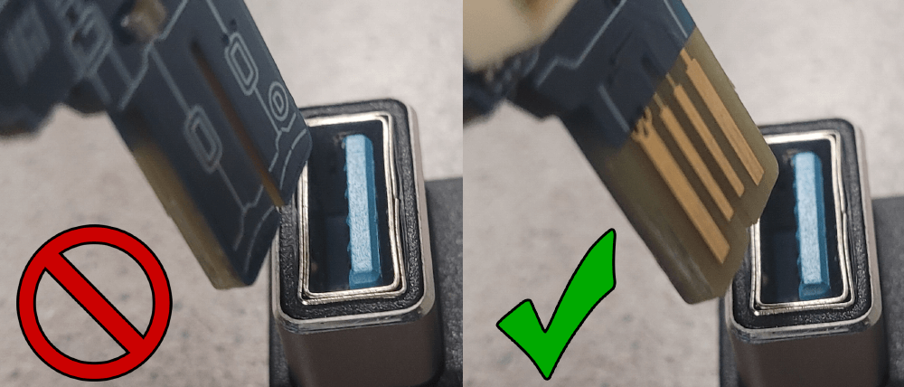
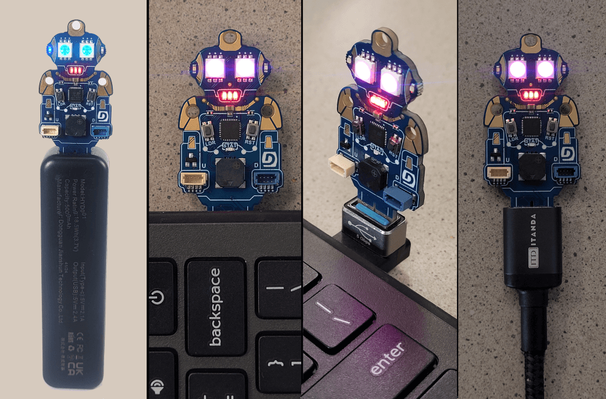

# DUELink Ghizzy

This page is a `Getting Started` page for `DUELink Ghizzy`. The full product details are [here](https://www.duelink.com/docs/products/spghizzy-d) on the main DUELink website. Are you an educator? See how DUELink can help you [here](https://www.duelink.com/docs/educators).

Don't have a DUELink Ghizzy yet? Get yours today! 

 

<iframe width="560" height="315" src="https://www.youtube.com/embed/D4073veneWI" title="YouTube video player" frameborder="0" allow="accelerometer; autoplay; clipboard-write; encrypted-media; gyroscope; picture-in-picture; web-share" referrerpolicy="strict-origin-when-cross-origin" allowfullscreen></iframe>

Ensure that Ghizzy is facing the proper direction when plugging into the USB port as show below.

Power up Ghizzy using a PC, phone charger, or power bank and enjoy the preloaded demo. 

Then use any computer to load one of the demo projects below as is, or **change it** any way you like!

To load a project: **Click** ➡ **Connect** ➡ **Run**!

1. **Click** on one of the project links below to load it into MicroBlocks. We explain what MicroBlocks is later on this page.
2. Click **Connect** on the top right corner. Then select the `USB` option. From the new window, select `DUELink`. 
    2. While not likely to happen, if you do not see a `DUELink` device, then you need to reload the MicroBlocks firmware. This is explained later on this page.
3. Click the **Run** triangle ▶ and enjoy! 🎉Congratulations, you are now a coder!

<table>
  <tr>
    <th>📽 Video</th>
    <th>Project Link</th>
    <th>Functionality</th>
  </tr>
  <tr>
    <td></td>
    <td><a href="https://microblocks.fun/run/microblocks.html?project=https://raw.githubusercontent.com/ghi-electronics/duelink-ghizzy/refs/heads/main/code/demo.ubp" target="_blank">Default Project Demo</a></td>
    <td>This is the default demo. Press the LDR button to make Ghizzy angry!</td>
  </tr>
  <tr>
    <td></td>
    <td><a href="https://microblocks.fun/run/microblocks.html?project=https://raw.githubusercontent.com/ghi-electronics/duelink-ghizzy/refs/heads/main/code/police.ubp" target="_blank">Policeman</a></td>
    <td>Ghizzy is policeman!</td>
  </tr>
   <tr>
    <td></td>
    <td><a href="https://microblocks.fun/run/microblocks.html?project=https://raw.githubusercontent.com/ghi-electronics/duelink-ghizzy/refs/heads/main/code/color-selector.ubp" target="_blank">Color Selector</a></td>
    <td>Push and hold the LDR button to cycle through Red, Green, and Blue. When you see the desired option release the button and wait for the beep. After the beep sound, Ghizzy will cycle through a range of that color channel. Once you see the color you like, press and hold until you hear sound, then release LDR. If MicroBlock can also show the selected color value, if is the software is connected.</td>
  </tr> 
   <tr>
    <td></td>
    <td><a href="https://microblocks.fun/run/microblocks.html?project=https://raw.githubusercontent.com/ghi-electronics/duelink-ghizzy/refs/heads/main/code/hearing-test.ubp" target="_blank">Hearing Test</a></td>
    <td>Push and hold the LDR button to sweep through a rising frequency. Release the button when you can't hear anything anymore. Ghizzy now will sound a beep for every 1KHz. So, for 4.3Khz, Ghizzy will beep 4 times. MicroBlocks also shows the actual frequency in Hz.</td>
  </tr>
   <tr>
    <td></td>
    <td><a href="https://microblocks.fun/run/microblocks.html?project=https://raw.githubusercontent.com/ghi-electronics/duelink-ghizzy/refs/heads/main/code/reaction.ubp" target="_blank">Ready Set Go!</a></td>
    <td>Ghizzy will start with notes for Read/Set/Go and then goes into a ticker that changes its time. BE ready with your finger on LDR button. As soon as you hear the raising frequency, push the button and look at your score on MicroBlocks. The lower the number the faster you are.</td>
  </tr>
   <tr>
    <td></td>
    <td><a href="https://microblocks.fun/run/microblocks.html?project=https://raw.githubusercontent.com/ghi-electronics/duelink-ghizzy/refs/heads/main/code/twinkle.ubp" target="_blank">Twinkle!</a></td>
    <td>Twinkle Twinkle, the Ghizzy way!</td>
  </tr>
</table>

---

## What is MicroBlocks?

If you want to learn coding the easy way, MicroBlocks is a block-based language that is easy for beginners (9 years to adults) to program DUELink boards. A huge benefit of MicroBlocks is that it is live and interactive; users can click commands to see what they do and they can test their scripts as they work.

Learn more about DUELink's [MicroBlocks support](https://www.duelink.com/docs/language/microblocks).

---

## Connect with us!

Ghizzy is possible because of our DUELink technology. But what is DUELink? Click [here](https://www.duelink.com/docs/what-is) to learn more.

Join our newsletter and social channels [here](https://www.duelink.com/news).

We are also on the DUELink section on [our forums](https://forums.ghielectronics.com/c/duelink/31).

---

## Reload MicroBlocks Firmware

In the unlikely event that MicroBlocks software is not seeing your device, then you need to follow these steps:

1. There are 2 buttons found on the board, Loader (LDR) and Reset (RST). Locate the buttons.
2. Press and hold the LDR button while pressing and releasing RST button. Note how you need to keep holding the LDR button pressed while pressing and releasing the RST button.
2. Go to [console.duelink.com](https://console.duelink.com/) and click `Firmware` on the top menu.
3. Click `Connect` button. You should see `DFU in FS Mode - Paired`. Select it and click `Connect`.
4. Select `MicroBlocks` from the `Firmware` menu.
5. Click `Load` button. You can optionally click `Erase All` first for a complete fresh start!
5. Click `Close`.

The board is now loaded with MicroBlocks firmware, which is what the MicroBlocks software uses to communicate with the board.

---

## The "Making of" Videos

Curious on how Ghizzy came about?

Video | Description
---|---
 | Ghizzy started as a swag item, was called John Due!
