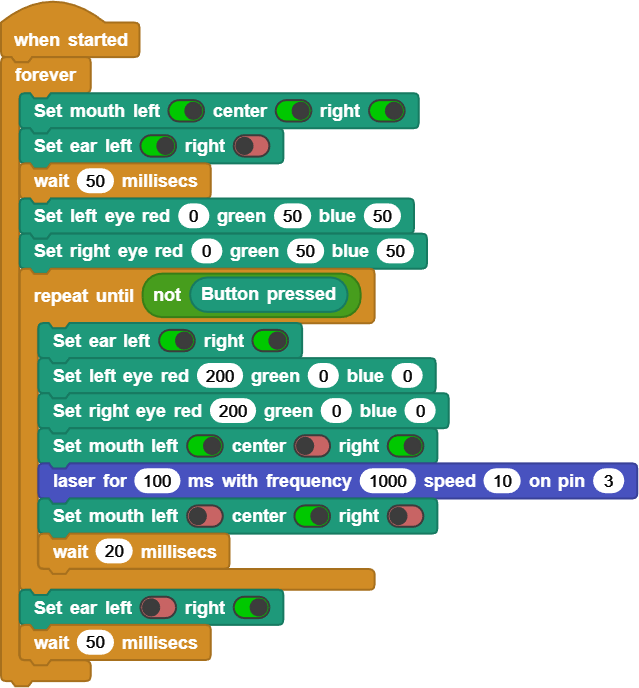

# DUELink Ghizzy

This is a `Getting Started` page for `DUELink Holiday Tree`.

This page is a `Getting Started` page for `DUELink Ghizzy`. It includes many demo programs/patterns that you can load onto it. You can see the full product details on the product page on the DUELink website [here](https://www.duelink.com/docs/products/spghizzy-d). To load any of the demos, or to make your own, you need these steps:

1. Plug Ghizzy into your PC USB port. You can optionally use a USB port extender if you need it to connect using a cable (not included).
2. Go to [https://microblocks.fun/run/microblocks.html](https://microblocks.fun/run/microblocks.html). You will need to use `Edge` or `Chrome` Internet browsers.
3. Click `Connect` button on the top right corner. Then select the `USB` option.
4. You should have one option only but if more than one then select the `DUELink` device. While not likely to happen, if you do not see a `DUELink` device then you need to reload the MicroBlocks firmware. This is explained at the bottom of this page.
5. The connect button you clicked earlier changes to a `DUELink` next to a green connect icon.
6. Click and drag [This Ghizzy Library Link](https://www.duelink.com/code/driver/microblocks/ghizzy.ubl) into the middle of the MicroBlocks page. If not sure how to drag a link, click the link to save the library on your PC then drag the saved file into the MicroBlocks page.
7. You can now drag any of the images (Example Blocks) below into the IDE to try them.

**Note:** It is easier to have 2 browser windows open simultaneously to drag the library and images. Another option is to save the image/library locally onto your machine then drag them in the browser later!

---

## Example Blocks

Demos (Drag into MicroBlocks) | Functionality
--- | ---
 | This is default demo. Press the LDR button to make Ghizzy angry!

Are you ready to make your own demos? The demos work as is but you can modify the blocks to change Ghizzy's behavior. Congratulations, you are now a coder!

---

## What is MicroBlocks?

If you want to learn coding, the easy way, MicroBlocks is a blocks language that makes it easy for beginners (9 years to adults) to program DUELink boards. A huge benefit of MicroBlocks is that it is live and interactive: Users can click commands to see what they do and they can test their scripts as they work.

Learn more about using [MicroBlocks support](https://www.duelink.com/docs/language/microblocks) on DUELink products.

---

## Connect with us!

Ghizzy is possible because of our DUELink technology. But what is DUELink? Click [here](https://www.duelink.com/docs/what-is) to learn more.

Join our newsletter and social channels [here](https://www.duelink.com/news).

We are also on the DUELink section on [our forums](https://forums.ghielectronics.com/c/duelink/31)

---

## Reload MicroBlocks Firmware

If MicroBlocks software is not seeing your device, you need to follow these steps:

1. There are 2 buttons found on the board, Reset (RST) and Loader (LDR). Locate the buttons.
2. Press and hold the LDR button while pressing and releasing reset. Note how you need to keep holding the LDR button pressed while pressing and releasing RST.
2. Go to https://console.duelink.com/ and click `Firmware` on the top menu.
3. Click `Connect` button. You should see `DFU in FS Mode - Paired`. Select it.
4. Select `MicroBlocks` from the `Firmware` menu.
5. Click `Load` button.
5. Click `Close`

The board is now loaded with MicroBlocks firmware, which is what the MicroBlocks software uses to communicate with the board.

---

## The "Making of" Videos

Curious on how Ghizzy came about? Watch the videos!

Video | Description
---|---
 | Ghizzy started as a swag item, called John Due!
