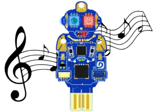

# DUELink Ghizzy

This page is a `Getting Started` page for `DUELink Ghizzy`. The full product details are [here](https://www.duelink.com/docs/products/spghizzy-d) on the main DUELink website. Are you an educator? See how DUELink can help you [here](https://www.duelink.com/docs/educators).

Don't have a DUELink Ghizzy yet? Get yours today! 

 

---

This was moved to: [www.duelink.com/docs/tutorial/ghizzy](https://www.duelink.com/docs/tutorial/ghizzy)
